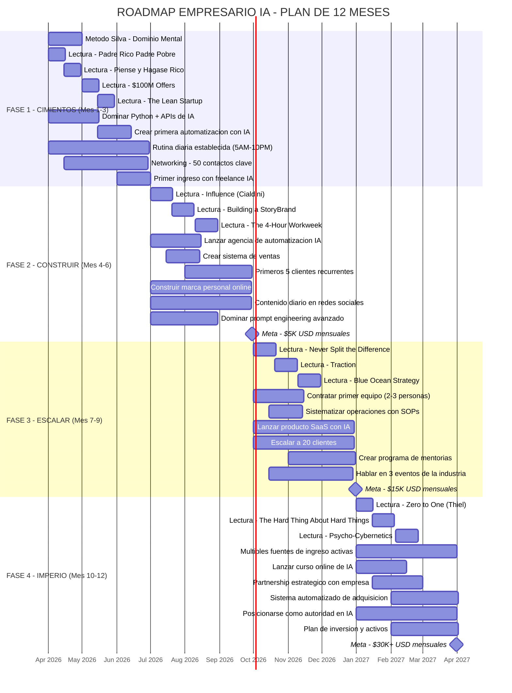
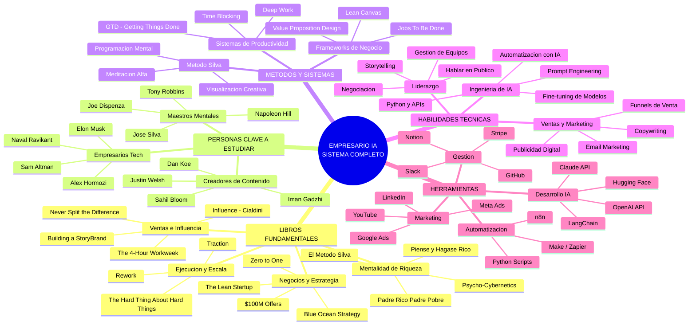
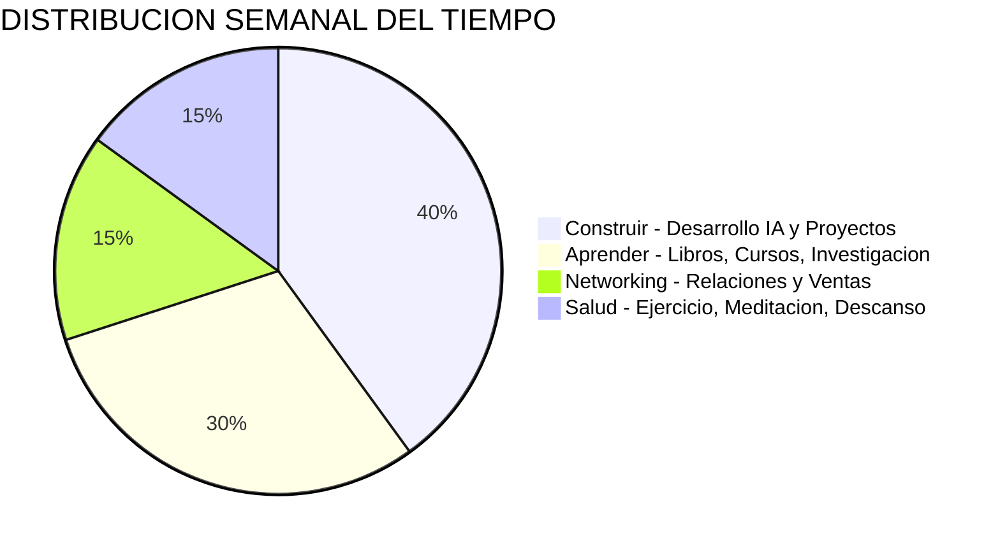
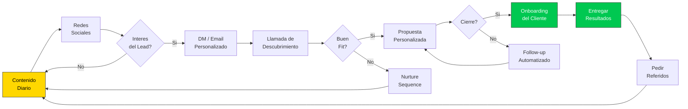

# ROADMAP EMPRESARIO IA - DIAGRAMAS MERMAID

---

## 1. PLAN DE 12 MESES - DIAGRAMA GANTT



---

## 2. MAPA MENTAL - SISTEMA COMPLETO DEL EMPRESARIO IA



---

## 3. FLUJO DE RUTINA DIARIA (5AM - 10PM)

```mermaid
flowchart TD
    A["5:00 AM<br/>DESPERTAR"] --> B["5:00 - 5:30<br/>Metodo Silva<br/>Meditacion Nivel Alfa"]
    B --> C["5:30 - 6:00<br/>Journaling +<br/>Visualizacion de Metas"]
    C --> D["6:00 - 7:00<br/>Ejercicio Fisico<br/>Gimnasio / Cardio"]
    D --> E["7:00 - 7:30<br/>Ducha Fria +<br/>Desayuno Nutritivo"]
    E --> F["7:30 - 8:00<br/>Lectura de Libro<br/>30 min minimo"]

    F --> G{{"8:00 AM<br/>BLOQUE DE TRABAJO<br/>PROFUNDO"}}

    G --> H["8:00 - 10:00<br/>DEEP WORK #1<br/>Proyecto Principal de IA<br/>Codigo / Desarrollo"]
    H --> I["10:00 - 10:15<br/>Pausa Mental<br/>Tecnica 3-3-3"]
    I --> J["10:15 - 12:00<br/>DEEP WORK #2<br/>Clientes / Entregas<br/>Automatizaciones"]

    J --> K["12:00 - 1:00 PM<br/>Almuerzo +<br/>Caminata al Aire Libre"]

    K --> L{{"1:00 PM<br/>BLOQUE DE<br/>CRECIMIENTO"}}

    L --> M["1:00 - 2:30<br/>Contenido +<br/>Marketing Personal<br/>Redes Sociales"]
    M --> N["2:30 - 4:00<br/>Ventas +<br/>Networking<br/>Llamadas / Emails"]
    N --> O["4:00 - 5:30<br/>Aprendizaje<br/>Cursos / Tutoriales<br/>Nuevas Herramientas IA"]

    O --> P{{"5:30 PM<br/>BLOQUE DE<br/>CIERRE"}}

    P --> Q["5:30 - 6:30<br/>Revision del Dia<br/>Metricas y KPIs"]
    Q --> R["6:30 - 7:30<br/>Cena en Familia<br/>Desconexion Digital"]
    R --> S["7:30 - 9:00<br/>Lectura Libre o<br/>Proyecto Personal<br/>Side Project"]
    S --> T["9:00 - 9:30<br/>Preparar Dia Siguiente<br/>Top 3 Prioridades"]
    T --> U["9:30 - 10:00<br/>Metodo Silva Nocturno<br/>Programacion del Sueno"]
    U --> V["10:00 PM<br/>DORMIR<br/>7 horas de descanso"]

    style A fill:#FFD700,stroke:#333,color:#000,font-weight:bold
    style G fill:#FF6B35,stroke:#333,color:#fff,font-weight:bold
    style L fill:#4ECDC4,stroke:#333,color:#000,font-weight:bold
    style P fill:#8B5CF6,stroke:#333,color:#fff,font-weight:bold
    style V fill:#1a1a2e,stroke:#FFD700,color:#FFD700,font-weight:bold
    style H fill:#FF6B35,stroke:#333,color:#fff
    style J fill:#FF6B35,stroke:#333,color:#fff
    style M fill:#4ECDC4,stroke:#333,color:#000
    style N fill:#4ECDC4,stroke:#333,color:#000
    style O fill:#4ECDC4,stroke:#333,color:#000
```



---

## 4. DISTRIBUCION DEL TIEMPO



---

## 5. VIAJE DE TRANSFORMACION - DE EMPLEADO A EMPRESARIO MILLONARIO

```mermaid
journey
    title Viaje de Transformacion - Empresario IA
    section Mes 1-3: DESPERTAR
      Descubrir el Metodo Silva: 3: Yo Actual
      Primer libro de mentalidad de riqueza: 4: Yo Actual
      Aprender Python y APIs de IA: 3: Yo Actual
      Establecer rutina de 5AM: 2: Yo Actual
      Primer proyecto de automatizacion: 4: Yo Actual
      Primer ingreso con IA freelance: 5: Yo Actual
    section Mes 4-6: CONSTRUIR
      Lanzar agencia de IA: 4: Yo en Crecimiento
      Conseguir primeros 5 clientes: 3: Yo en Crecimiento
      Crear marca personal online: 4: Yo en Crecimiento
      Dominar ventas y persuasion: 4: Yo en Crecimiento
      Llegar a $5K mensuales: 5: Yo en Crecimiento
    section Mes 7-9: ESCALAR
      Contratar primer equipo: 3: Yo Empresario
      Lanzar producto SaaS: 4: Yo Empresario
      Hablar en eventos de IA: 5: Yo Empresario
      Sistematizar operaciones: 4: Yo Empresario
      Llegar a $15K mensuales: 5: Yo Empresario
    section Mes 10-12: IMPERIO
      Multiples fuentes de ingreso: 4: Yo Millonario
      Curso online exitoso: 5: Yo Millonario
      Reconocido como autoridad en IA: 5: Yo Millonario
      Sistema funcionando sin ti: 5: Yo Millonario
      Superar $30K mensuales: 5: Yo Millonario
```

---

## 6. DIAGRAMA DE FLUJO - SISTEMA DE ADQUISICION DE CLIENTES



---

> **Nota**: Para visualizar estos diagramas, usa cualquier visor Mermaid compatible como GitHub, GitLab, Notion, Obsidian, VS Code con extension Mermaid, o [mermaid.live](https://mermaid.live).
