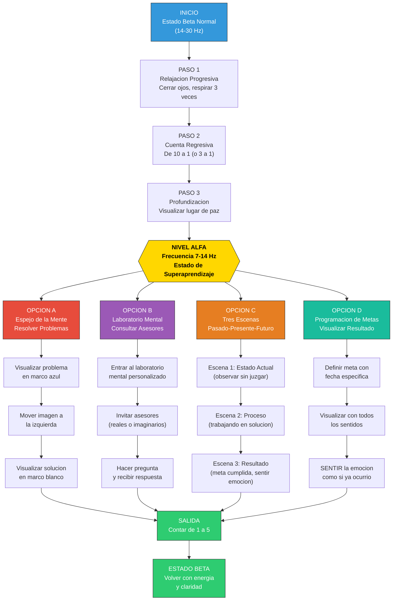
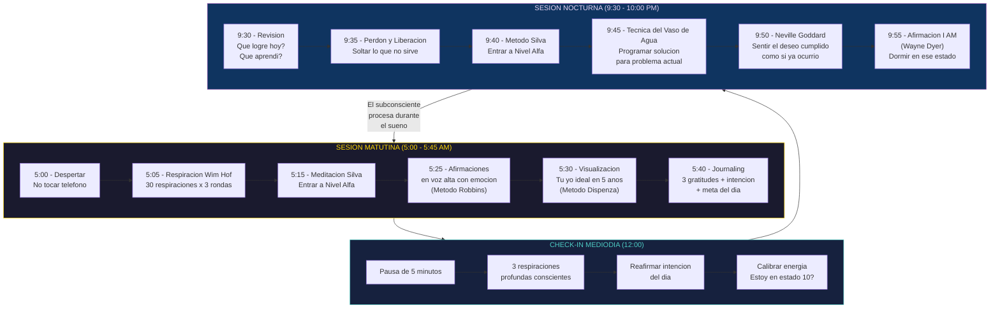
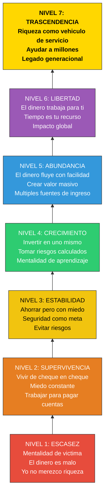
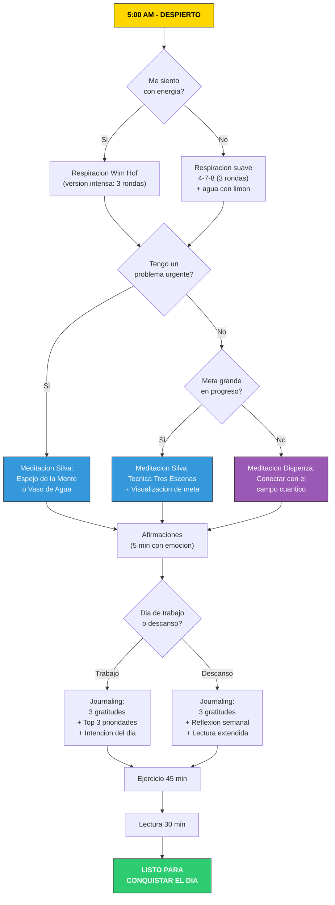
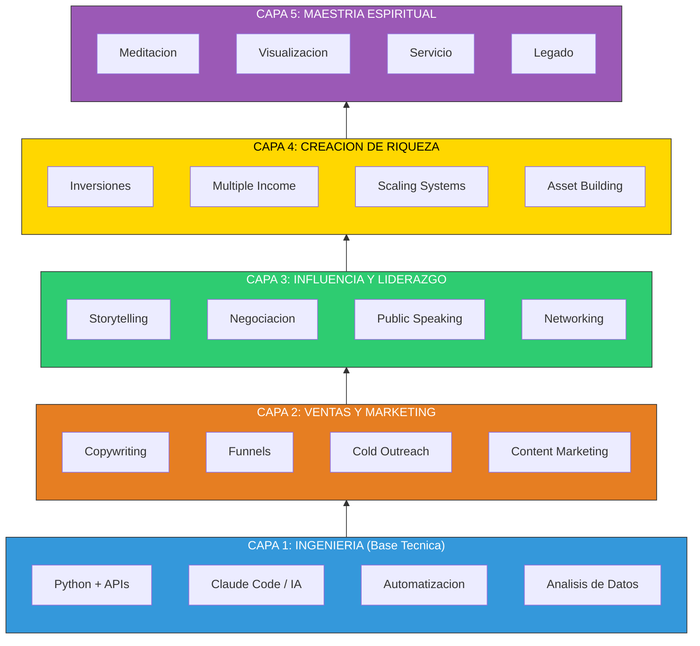

# DIAGRAMAS DEL METODO SILVA Y REPROGRAMACION MENTAL

---

## 1. PROCESO COMPLETO DEL METODO SILVA

---

## 2. PROTOCOLO DIARIO DE REPROGRAMACION MENTAL

---

## 3. NIVELES DE CONSCIENCIA DE RIQUEZA

---

## 4. ONDAS CEREBRALES Y TECNICAS ASOCIADAS

```mermaid
flowchart LR
    subgraph BETA["BETA (14-30 Hz)"]
        B1["Estado normal de vigilia"]
        B2["Pensamiento analitico"]
        B3["Estres, ansiedad"]
    end

    subgraph ALPHA["ALFA (7-14 Hz) - ZONA SILVA"]
        A1["Relajacion profunda"]
        A2["Superaprendizaje"]
        A3["Creatividad aumentada"]
        A4["Programacion mental"]
    end

    subgraph THETA["THETA (4-7 Hz) - ZONA DISPENZA"]
        T1["Meditacion profunda"]
        T2["Acceso al subconsciente"]
        T3["Sanacion y reprogramacion"]
        T4["Intuicion elevada"]
    end

    subgraph DELTA["DELTA (0.5-4 Hz)"]
        D1["Sueno profundo"]
        D2["Regeneracion celular"]
        D3["Neville Goddard:<br/>Programar antes de dormir"]
    end

    BETA -->|"Metodo Silva<br/>Cuenta regresiva<br/>10 a 1"| ALPHA
    ALPHA -->|"Dispenza<br/>Meditacion extendida<br/>45-60 min"| THETA
    THETA -->|"Transicion<br/>natural al sueno"| DELTA

    style BETA fill:#e74c3c,stroke:#333,color:#fff
    style ALPHA fill:#FFD700,stroke:#333,color:#000,font-weight:bold
    style THETA fill:#9b59b6,stroke:#333,color:#fff
    style DELTA fill:#2c3e50,stroke:#333,color:#fff
```

---

## 5. ARBOL DE DECISIONES - RUTINA MATUTINA

---

## 6. EL STACK DE HABILIDADES DEL EMPRESARIO IA

---

> **Nota**: Visualiza estos diagramas en GitHub, Obsidian, VS Code (extension Mermaid), o [mermaid.live](https://mermaid.live).
